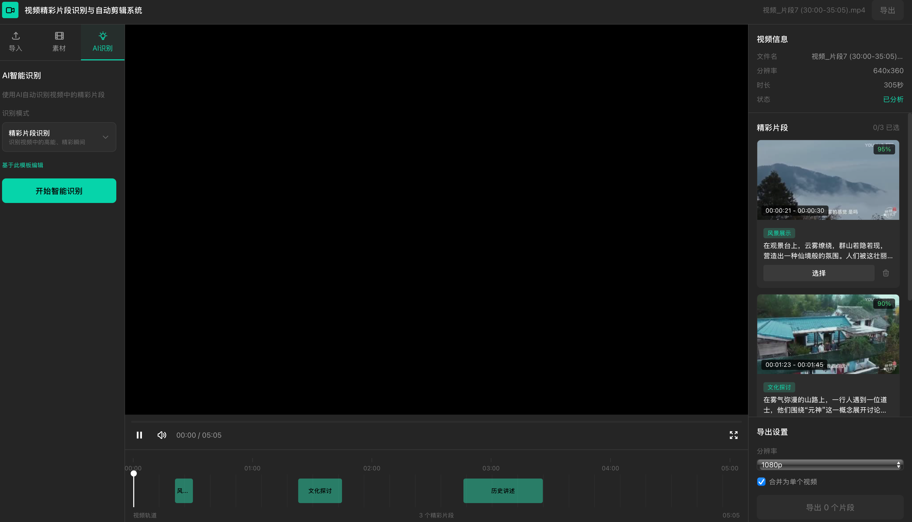

# Video Clip Editor

智能视频精彩片段识别与自动剪辑系统

## 界面预览



## 功能特性

- 上传视频文件
- 通过多模态 LLM (智谱 GLM-4.6V) 自动识别精彩片段
- 可视化时间线编辑
- 自动剪辑并导出 MP4

## 技术栈

| 层级 | 技术 |
|------|------|
| 前端 | React 18 + Vite + TailwindCSS |
| 后端 | Python FastAPI |
| 视频处理 | FFmpeg |
| LLM | 智谱 AI GLM-4.6V |
| 对象存储 | 阿里云 OSS |

## 快速开始

### 环境要求

- Node.js >= 18
- Python >= 3.10
- FFmpeg

### 安装依赖

```bash
# 后端
cd backend
pip install -r requirements.txt

# 前端
cd frontend
npm install
```

### 配置环境变量

复制 `backend/.env.example` 为 `backend/.env`，填入配置：

```env
ZHIPU_API_KEY=your-zhipu-api-key
OSS_ACCESS_KEY_ID=your-access-key-id
OSS_ACCESS_KEY_SECRET=your-access-key-secret
OSS_ENDPOINT=oss-cn-hangzhou.aliyuncs.com
OSS_BUCKET_NAME=your-bucket-name
```

### 启动服务

```bash
# 后端 (端口 8000)
cd backend
uvicorn app.main:app --reload

# 前端 (端口 3000)
cd frontend
npm run dev
```

### 访问

- 前端: http://localhost:3000
- API 文档: http://localhost:8000/docs

## 项目结构

```
video_cut/
├── frontend/          # React 前端
│   ├── src/
│   │   ├── components/   # UI 组件
│   │   ├── pages/        # 页面
│   │   └── services/     # API 服务
│   └── package.json
├── backend/           # FastAPI 后端
│   ├── app/
│   │   ├── routers/      # API 路由
│   │   ├── services/     # 业务服务
│   │   └── models/       # 数据模型
│   └── requirements.txt
└── README.md
```

## License

MIT
